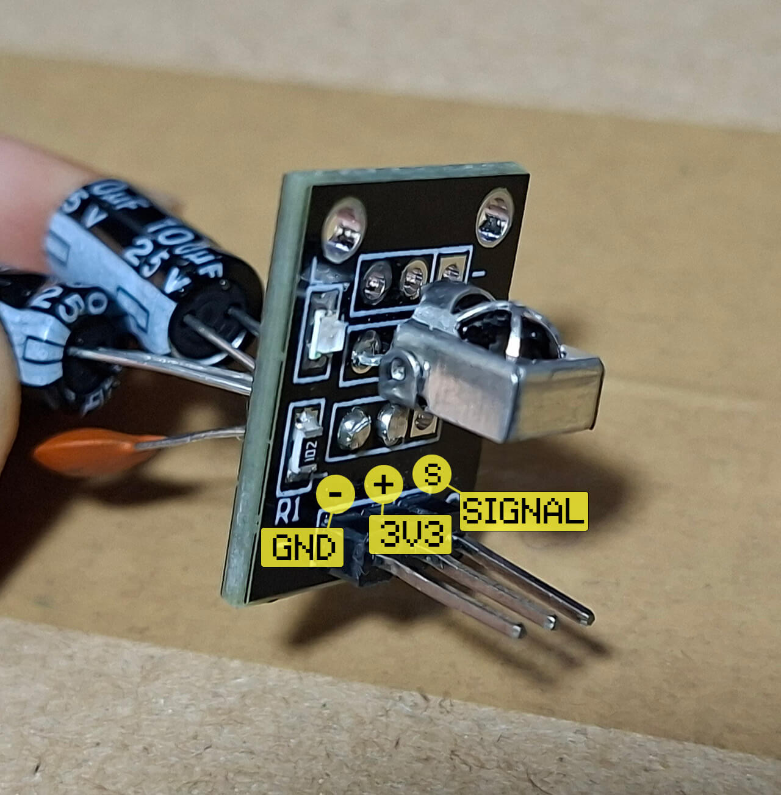
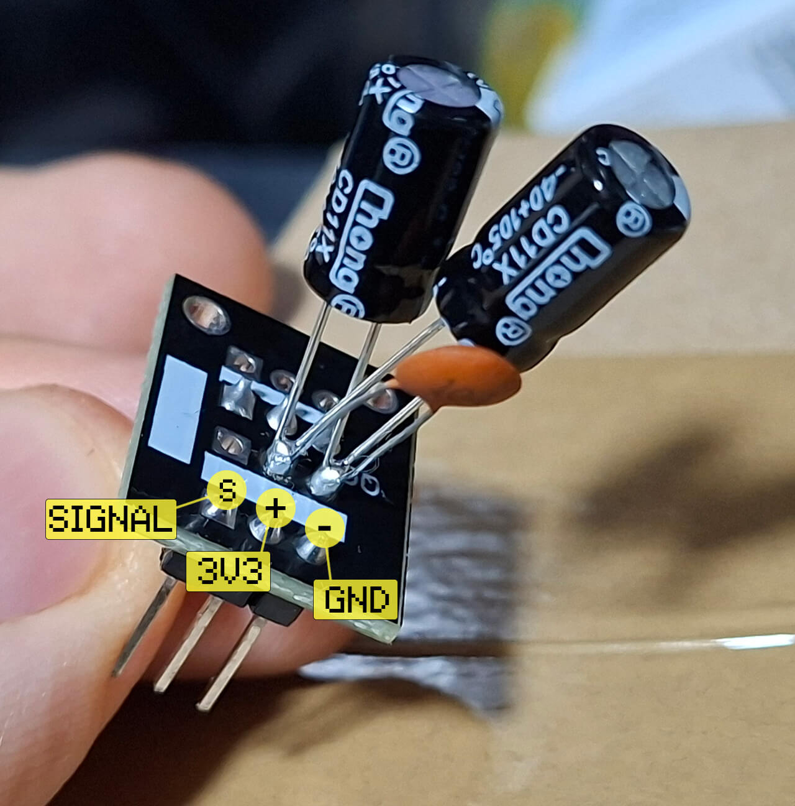
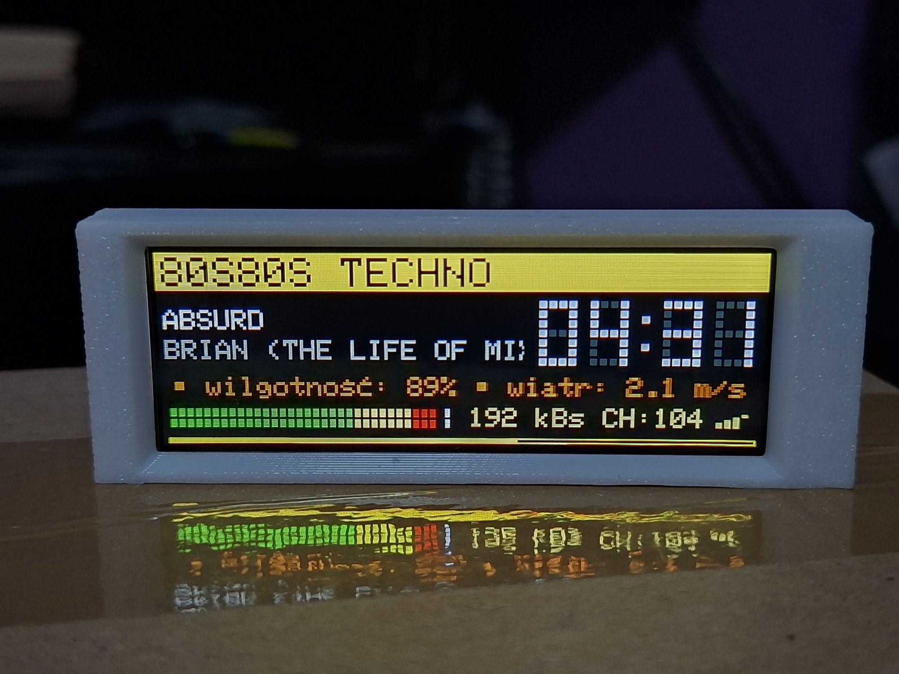
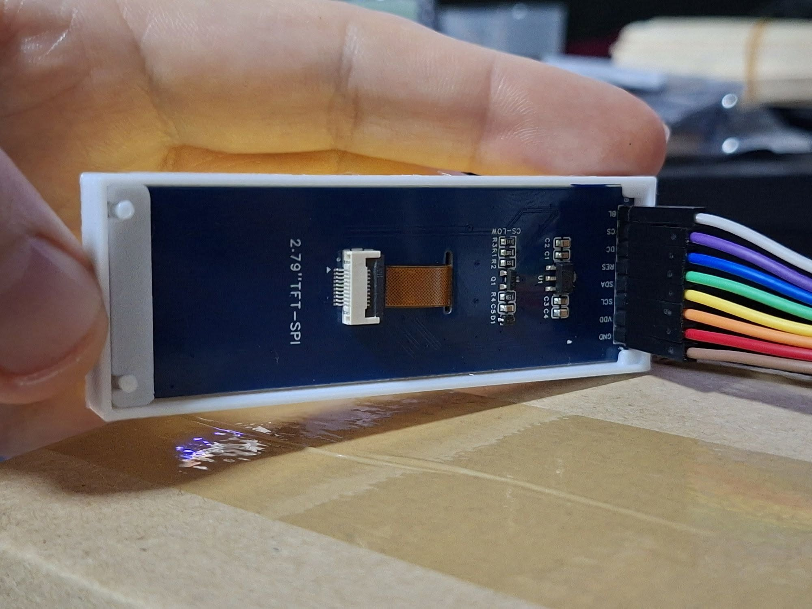

# yoRadio V-Tom (Modded by kc-dev)
[](README.md)
[](README_PL.md)

I've added support for the following displays:

- NV3007 428x142 2.79" https://pl.aliexpress.com/item/1005012251243789.html
- ST7789 284x76 2.25" https://aliexpress.com/item/1005009016973081.html

## NV3007 428x142 2.79"

<a href="https://youtu.be/3gqVbwaUH2E?si=ETXbSLO5y7pVvZy1">
    
</a>

<a href="https://youtu.be/OIB90S6o9-4?si=mor6tHdsKJRHwaaY">
    
</a>

## ST7789 284x76 2.25"

<a href="https://youtu.be/pyjyYVzSvXk?si=yCLboO9ejS3hEOCV">
    
</a>


## 🔵 Informations

Two configuration files (two layouts) have been prepared for the NV3007 2.79" 428x142 display.<br />- **(Layout 1)** in the `src/displays/conf/displayNV3007_142conf.h` file <br />- **(Layout 2)** in the `src/displays/conf/displayNV3007_142conf.h.copy` file <br />*To change the layout, simply swap the file names.* <br /><br /> Support for the **NV3007** display has been added to the **"Adafruit ST7735 and ST7789 Library WITHOUT SD"** library based on files from the **"Arduino GFX"** library. <br /><br /> In addition to the display libraries and configuration files, several improvements have been made to enhance the display of certain interface elements, including moving the IP address to the volume screen to avoid cluttering the main screen. <br /><br />I also added the ability to force a custom station name by adding a comma before the station name, e.g. `,MY STATION`. This is useful for stations that provide incorrect metadata tags. <br /><br />


# 🔵 Instructions for Arduino IDE (tested on version 2.3.10)
## 🔹1. Arduino IDE Settings

<a href="Arduino IDE 2.3.10 settings/EN_ArduinoIDE_SETTINGS.png">
    
</a>

## 🔹2. Library Installation
Move library folders manually from <br />`yoRadio/.pio/libdeps/esp32-s3-devkitc1-n16r8` <br /><a href="Arduino IDE 2.3.10 settings/libraries_pio.png"></a> <br />to `C:\Users\user\Documents\Arduino\libraries` <br /><a href="Arduino IDE 2.3.10 settings/libraries_arduino.png"></a>

# 🔵 Example connection of elements
Example connection of elements according to my `myoptions.h` file used in one of my projects. <br /><br/>The NV3007 (428x142) and ST7789 (284x76) displays operate with identical pin connections. <br/>The only difference is the BLK pin, which handles the backlight in reverse (i.e., dimming and brightening on the ST7789 works in reverse). <br /><br/>When connecting an IR receiver (KY-022 or similar), I recommend soldering capacitors on the board (as close to the IR diode as possible): 220uF (electrolytic), 100nF (ceramic) so that the readings from the remote control do not fluctuate due to interference. <br/>⚠️ **Attention! Remember to set the correct +/- polarity of the electrolytic capacitor!** <br/><br/> The DAC GY-PCM5102 module requires soldering the jumpers immediately after purchase (<a href="PCM5102A/jumpers.png">example here</a>)
<a href="PCB/yoRadio ESP32-S3-WROOM-1-N16R8-NV3007_ST7789_76_bb.png">
    
</a>
<br />

This is how I soldered the filter to the KY-022 module (I didn't have a 220uF capacitor, so I used two 100uF ones)
<a href="images/KY-022/KY-022_FRONT.jpg">
    
</a>
<a href="images/KY-022/KY-022_BACK.jpg">
    
</a>


# 🔵 Frame for 3D print
A ready-made display frame for use when designing a 3D printable enclosure.  <br/>In two STL files: <a href="3D/Frame.stl">Frame.stl</a>, <a href="3D/Frame-clip.stl">Frame-clip.stl</a>

https://makerworld.com/en/models/2924122-frame-for-lcd-nv3007-2-79-428x142-to-yoradio<br/><br/>
<a href="3D/frame1.jpg">
    
</a>
<a href="3D/frame2.jpg">
    
</a>


# 🔵 Modified by kc-dev version history
## v0.8.8 | Mod 0.0.5 (22.06.2026)
- Fix removing the comma from the beginning of the station name (in the station list when using the modification that allows setting a fixed station name)
## v0.8.8 | Mod 0.0.4 (22.06.2026)
- Fix in the NV3007 support library (improved height and spacing when the screen was rotated because the spacing of elements on the screen was different when rotated)
- Fixed heapbar and volbar for NV3007
- Fix loading animation (on boot screen)
## v0.8.8 | Mod 0.0.3 (19.06.2026)
- Fix NV3007 config (VU meter position) - Previously, you had to flip the screen to display it correctly.
- Improved clearing of the display when stopping playback. Previously, it cleared across the entire width of the vu meter. This now prevents it from overlapping footer elements like the channel number and range icon (they no longer disappear).
## v0.8.8 | Mod 0.0.2 (13.06.2026)
- Add fix for KY-022 IR Receiver module
- Add a graphic with an example of connecting elements prepared in the Fritzing program
## v0.8.8 | Mod 0.0.1 (12.06.2026)
- Added support for NV3007 428x142 2.79" and ST7789 284x76 2.25"


<br /><br /><br /><br /><br /><br /><br /><br /><br /><br /><br /><br /><br /><br /><br /><br />
==============\\// Original vTom README \\//==============<br /><br />

# yoRadio V-Tom


### A program alapja a ёRadio v0.9.720 https://github.com/e2002/yoradio
Ezt mindenképpen olvasd végig.
https://github.com/e2002/yoradio

---
## yoRadio V-Tom
- [Telepítési tanácsok](#telepitesi-tanacsok)
- [Nyelvek, területi beállítások](#nyelvek-teruleti-beallitasok)
- [Névnapok megjelenítése](#nevnapok-megjelenitese)
- [PCB nyomtatott áramkör](#pcb-nyomtatott-aramkor)
- [3D nyomtatási tervek](#3d-nyomtatasi-tervek)
- [Version history](#version-history)

---
## Telepitesi tanacsok
!!! Figyelem !!!
Ez a verzió kizárólag az ESP32-S3-devkit-C1 N16R8, 44 lábú modulhoz és
- ILI9488 480x320 felbontású SPI (LCD)
- ILI9341 320x240 felbontású SPI (LCD)
- ST7796  480x320 felbontású SPI (LCD)
- SSD1322 256x64 felbontású SPI (OLED)

kijelzőhöz készült és csak az audioI2S DAC eszközzel működik megfelelően, [PCM5102A](PCM5102A) -val tesztelve!
- Amennyiben mindig a hangerő jelenik meg ellenőrízd a következőket:
   - Az LCD kijelzőn nem szabad bekötni a MISO_13 vezetéket, mert arra nincs szökség!
   - Ha nem használsz touch funkciót, akkor ne definiáld a myoptions.h fájlban, kommenteld ki!  
```cpp
/* Touch */
// #define TS_MODEL TS_MODEL_XPT2046
// #define TS_CS    3
```
- Nem támogatja az ESP32-t PSRAM memória nélkül.   
- Az Arduino-ESP32 Core 3.3.3 vagy újabb verziójú Espressif Arduino keretrendszerre van szükség.  
- A partíció sémánál válaszd "Custom" A program a saját partitions.csv fájllal rendelkezik a gyökér könyvtárban, így ez kerül beolvasásra.
- Nagyon fontos, hogy a "yoRadio/data/data" mappa feltöltése után töröld a böngésző előzményeit és a web megnyitása után nyomd meg a Ctrl+Shift+R gombokat a web felület valódi frissítéséhez (Google chrome)!!!  Másik módszer F12 gomb megnyomása után a megnyíló fejlesztői ablakban a "Network" fülre kattíntva megjelenik a "Disable cache" opció. Ezt bepipálva majd Ctrl+Shift+R billentyű valódi frissítést hajt végre.
- Ha az IR (infrared) beállítása nem működik, [ olvasd el ezt!](PCB/IR/ir_power_filter.md)
- Ha nagy bitrátájú sztrimek lejátszásakor szakadozást tapasztalsz akkor [olvasd el ezt!](Lib_tools/LIB_TOOLS.md)

Ez a konfiguráció néhány további könyvtártól függ. Kérlek, telepítsd őket a könyvtárkezelővel vagy PlatformIO esetén használd a mellékelt platformio.ini fájlt.
- Adafruit GFX Library  1.12.3  https://github.com/adafruit/Adafruit-GFX-Library.git
- RTCLib                2.1.4   https://github.com/adafruit/RTClib.git
- Adafruit_ILI9341      1.6.2   https://github.com/adafruit/Adafruit_ILI9341.git   (szükség esetén)

## Nyelvek, teruleti beallitasok:

Aprogram beépített nyelveket és területi beállításokat tartalmaz HU, PL, GR, EN, RU, NL, SK, UA, DE nyelveken.   
A myoptions.h fájlban az alábbi paranccsal állíthatod be.   
```
#define L10N_LANGUAGE HU
```

A program az Adafruit_GFX librarit használja, ahol egy 5x7 pixel méretű fontot skáláz fel a kért méret függvényében. Ez a font a glcdfont.c fájlban van megrajzolva.    
A fájlok helye:   
Arduino IDE esetén a számítógép Dokumentumok/Arduino/libraries/Adafruit_GFX_Library/.glcdfont.c    
PlatformIO esetén a \yoRadio\\.pio\libdeps\esp32-s3-devkitc1-n16r8\Adafruit GFX Library\glcdfont.c

Ha nálad nem jelennek meg helyesen a karakterek, akkor ezt a fájlt le kell cserélni a nyelvedhez tartozó fájlra. A WiFi kijelzés és hangszóró kijelzés helytelenül jelenik meg, valamint azoknál a nyelveknél, melyek az angoltól eltérő karakterkészletet használnak (ékezetest), különböző a nyelvekhez szerkesztett fájlt kell használni és arra lecserélni az eredetit.
Ezek itt találhatóak a programban:

      yoRadio/locale/glcdfont/EN, NL, CZ/glcdfont.c
      yoRadio/locale/glcdfont/GR/glcdfont.c
      yoRadio/locale/glcdfont/HU, DE/glcdfont.c
      yoRadio/locale/glcdfont/PL, SK, DE/glcdfont.c
      yoRadio/locale/glcdfont/RU/glcdfont.c
      yoRadio/locale/glcdfont/UA/glcdfont.c

A myoptions.h fájlban beállított pin-ek ajánlottak a helyes működéshez és a mellékelt PCB 
alaplap szerint van konfigurálva.
Itt tovább alakítható.
https://trip5.github.io/ehRadio_myoptions/generator.html 

Az ESP modulról itt olvasható:   
esp32-S3-devkit-C1 44 pins https://randomnerdtutorials.com/esp32-s3-devkitc-pinout-guide 

## Nevnapok megjelenitese:
A program képes megjeleníteni a HU, PL, GR, DE nyelvű névnapokat.
A myoptions.h fájlban az alábbi paranccsal lehet bekapcsolni és beállítani a kívánt nyelvet.
```cpp
#define NAMEDAYS_FILE HU
```   

A névnapok tárolása az alábbi fájlokban történik.

      local/namedays/namedays_HU.h
      local/namedays/namedays_PL.h
      local/namedays/namedays_GR.h  
      local/namedays/namedays_DE.h

Ha más nyelven szeretnéd használni vedd fel velem a kapcsolatot.

Ha nem szeretnéd megjeleníteni, akkor kommenteld ki a sort, 
```   
// #define NAMEDAYS_FILE HU   
```
vagy a WEB-es felületen kikapcsolható options/tools-> Namedays gombbal.

## PCB - nyomtatott aramkor:
- A PCB gyártáshoz szükséges gerber fájl, kapcsolási rajz, és egyéb információ a [PCB](PCB) mappában található.   
- Építési javaslatok [PCB_2025.12.21. oldalon láthatóak.](PCB/PCB_2025_12_21/readme.md) 
- Tápegységre javaslat [PCB_2025.12.21. oldalon látható.](PCB/Power_supply_with_IR_sensor/readme.md) 
- Ahol a PCB -k készülnek JLCPCB --> [jlcpcb.com](https://jlcpcb.com/?from=AMOSWLDYVIS)  

Ezek a PCB lapok az alábbi 3D nyomtatási tervekhez igazodnak.

## 3D nyomtatasi tervek és a hozzájuk illeszkedő kijelzők
- IPS 4.0 Inch, SPI, ILI9488 Factory TFT LCD 480*320, 14 Pin Electronic Board  
(SPI resistive touch XPT2046) https://www.aliexpress.com/item/1005006287831546.html
   - 3D nyomtatási terv --> https://www.printables.com/model/1489380-yoradio-case-for-ips-40-inch-ili9488-tft-lcd-48032
- IPS 3.5 Inch, SPI, ILI9488 14 pin Full View Angle 480*320 
(I2C capacitive touch FT6236) https://www.aliexpress.com/item/1005007789737257.html    
   - 3D nyomtatási terv --> https://www.printables.com/model/1621877-yoradio-case-for-ips-ctp-35-inch-spi-red-ili9488-f

## Version history:  
### v0.8.8
- Az audioI2S audio könyvtár a Schreibfaul1 által fejlesztett V3.4.5h (2026. marc 18.) frissítés.
- Távirányító deep sleep módból ébresztés más távirányítókra is felébredt ezért mostantól a POWER gombot kétszer kell megnyomni az ébresztéshez.
- A távirányító BACK gombjával mostantól a csatornaszám beírásakor lehet visszatörölni egy karaktert, ha elrontottuk.
### v0.8.7  
- Teljesen átdolgozott távirányító-vezérlés, a tanításnál egyértelmű jelölésekkel.  
   A WEB UI- on frissíteni kell az alábbi fájlokat:   
   ```
      - ir.css.gz    
      - ir.js.gz  
      - irrecord.html.gz   
      - style.css.gz
   ```          
   Új gombok:  
      - POWER – deep sleep módba helyezi az ESP kontrollert / felébreszti  
      - LIST – közvetlenül a lejátszási listát nyitja meg   
      - BACK – visszalép a player képernyőre  
      Ajánlott távirányító https://www.aliexpress.com/item/1005010439257796.html    
- A WAKE_PIN helyett mostantól két pin állítható be az ébresztéshez: WAKE_PIN1 és WAKE_PIN2 , így távirányítóval és egy másik gombbal is felébreszthető az eszköz.   
   - Ébresztéshez csak RTC GPIO használható (GPIO0 – GPIO21).   
   - Aki eddig az IR_PIN 38 -at használta, annak át kell állnia például GPIO2-re. A PCB -n ez átkötéssel jár!

### v0.8.6
   - Új beállítás a myoptions.h fájlban. Letíltja az encoder gomb másodlagos funkcióját. *(by Karol Wysocki)*
      - Első gomb csak hangerő
      - Második gomb csak csatornalista

   Csak két encoder esetén használd !!!
   ```
   #define ENCODERS_INDEPENDENT
   ```
   - Új beállítás a myoptions.h fájlban. Definiálásával a rádió indulásakor mindig a csatornalista első eleme lesz az aktuális.  *(by Karol Wysocki)*
   ```
   #define ALWAYS_START_FROM_FIRST
   ```
   - DSP_SSD1322 OLED kijelzőnél a Title2 sor eltűnik hiba javítása.
   - Ha a lejátszási listára kapcsolunk és nem változtatunk csatornát a lejátszás újraindul. Ez a hiba lett javítva.

### v0.8.5
   - FADE CONTROL szolgáltatás hozzáadva a WEB UI -hoz. Lehetővé teszi egy beállított fényerő, lépésenként elérését, adott idő elteltével. OLED esetén csak kontraszt csökkentést hajt végre, így kímélhető a kijelző.  
   Teljes data/www mappa feltöltése szükséges!!! (by Zsolt Simon) 
   - Indításnál több időt kap a WiFi a hálózatok keresésére, így elkerüli a korai AP üzemű indítást.  
   (by Tomasz Bugno)
### v0.8.4
   - FT6X36 kapacitív driver hozzáadva.
   - mytheme.h fájl kiegészült az aktuális csatornaszám kijelzésének színével.
   ```
   #define COLOR_CH  165, 162, 132
   ```
   - A myoptions.h fájl kiegészült. A lejátszási listában a cursor mozog LE - FEL. (by Maciej Bednarski)
   ```
   #define PLAYLIST_SCROLL_MOVING_CURSOR
   ```
   - A myoptions.h fájl kiegészült. Rádió módban, ha elfogy az adatbuffer automatikusan STOP és PLAY (by Andrzej Jaroszuk)
   ```
   #define ENABLE_STALL_WATCHDOG
   ```
   - A myoptions.h fájl kiegészült. Ezzel a bejegyzéssel a képernyő színei szürkeárnyalatosak lesznek.
   ```
   #define THEME_GRAY
   ```
### v0.8.3
   - SSD1322 OLED kijelző hozzáadva.
   - Az aktuális lejátszási listaszám megjelenítése a kijelzőn.
### v0.8.2
   - Az audioI2S audio könyvtár a Schreibfaul1 által fejlesztett V3.4.4g (2026. jan 16.) frissítés.
   - IRremoteESP8266 könyvtár frissítése v2.9.0 verzióra.
      https://github.com/crankyoldgit/IRremoteESP8266
### v0.8.1
   - Bekerült két új beállítás a myoptions.h fájlba. A touch képernyőn szükség szerint lehetőség van tükrözni az X vagy Y coordinátákat. 
   ```
   #define X_TOUCH_MIRRORING
   #define Y_TOUCH_MIRRORING
   ```
### v0.8.0
   - Presets rendszer a kedvenc rádiócsatornák gyors eléréséhez. Lehetővé teszi, hogy bármely rádióállomást elments és később egyetlen érintéssel visszahívd, még akkor is, ha a playlist időközben megváltozik. Csak 320x480 felbontású kijelzőn működik. További infóért [olvasd el ezt!](docs/presets.md) (Grzegorz Słupik ötlete alapján).  
   Figyelem a displayL10n_xx.h fájlok bővítésre kerültek! Óvatosan a másolásokkal.
   - Spanyol nyelv hozzáadva https://github.com/Kuzeex támogatásával.
### v0.7.13
   - Erősítő vezérlése képernyővédővel és hangerővel ( by Łukasz Antoszewski ) [olvasd el ezt!](docs/pwr_amp.md)
   - PL, SK, DE glcdfont.c nyelvi fájl frissítve. (by Andrzej Jaroszuk) 

### v0.7.12 
   - A hangszínszabályzó hibájának javítása.

### v0.7.11
   - Az audioI2S audio könyvtár a Schreibfaul1 által fejlesztett V3.4.4c (2025. dec 11.) frissítés
   - A VU kijelző a lejátszások között nem ment nullára hiba javítása és ujrahangolása 

### v0.7.10
   - Ha le akarod tíltani a META adatokat és helyette a tárolt rádiónevet szeretnéd a kijelzőn látni, 
     akkor a lejátszási listában a beírt név elé tegyél egy pontot.
   - Német nyelv és névnapok hozzáadása. (by Schmid Christian) 
   - Ezzel a beállítással a szél sebessége km/h lesz. #define WIND_SPEED_IN_KMH  
   - META megjelenítés javítások.   

### v0.7.9
   - Az audioI2S audio könyvtár a Schreibfaul1 által fejlesztett V3.4.3zd (2025. nov 27.) frissítés
   - Az SD lejátszó működési hibáinak javítása
   - Az SD lejátszásnál nem írta ki a META adatokat a képernyőre hiba javítása
   - Az audio balance web UI állítója fordítva működött hiba javítása
   - Lejátszási lista mentésénél üres lista jelent meg a web UI -on hiba javítása
### v0.7.8 
   - Frissítésre került az audioI2S audio könyvtár a Schreibfaul1 által fejlesztett V3.4.3v (2025. nov 16.) 
   - A Title1 sor elején idegen karakterek hiba javítása 
   - A Lib_tools mappa lib fájlok cseréje (libesp_netif.a, liblwip.a) [olvasd el ezt!](Lib_tools/LIB_TOOLS.md) 
   - Görög nyelvi fájl frissítve  (by Antreas Mpokas)
### 0.7.7
   - Az audioI2S audio könyvtár a Schreibfaul1 által fejlesztett V3.4.3r (2025. nov 12.) frissítés
      https://github.com/schreibfaul1/ESP32-audioI2S.git
   - Kivezetésre került a VS1053 audio könyvtár
   - META adatok javítása  
### v0.7.6
   - Visszakerült a programba az audioI2S régebbi verziója mely stabilabb lejátszást biztosít  
      Version 3.1.   
      Updated on: Feb 01.2025, Feb 09.2025 (Maleksm)  
      Author: Wolle (schreibfaul1)  
      https://github.com/schreibfaul1/ESP32-audioI2S.git
### v0.7.5
   - AM/PM 12 órás időformátum hozzáadva. myoptions.h -> #define AM_PM_STYLE
   - Szlovák dátum kiegészítése a nap nevével
   - Clock TTS lengyel nyelvi javítás (by Mirosław Bubka)
   - Görög nyev karakterek javítása (by Antreas Mpokas)

### v0.7.4
   - Ukrán(UA) nyelv hozzáadva (by Vadim Poljakovszkij)
   - A dátum kifejezés meghosszabítva 38 karakterre
   
### v0.7.3
   - Elérhetővé váltak a görög névnapok és görög nyelv. (by Antreas Mpokas)
   - Beállítható az eredeti hét szegmenses óra betűtípus a myoptions.h -ban. #define CLOCKFONT VT_DIGI_OLD
   - A területi beállításokhoz tartozó fájlok glcdfont, displayL10n, namedays egységesen a local mappába kerültek.
   - Lengyel nyelv és névnapok javítása. (by Andrzej Jaroszuk)
   - [Új WEB kereső hozzáadva 2.0 (by Mirosław Bubka)](images/MB_2.0/MB_search.md)

### v0.7.2
   - IR hangerő túlfutott a 0-100 tartományon, ez lett javítva. 
   - Új beállítási lehtőség a myoptions.h fájlban
   - #define DIRECT_CHANNEL_CHANGE
      Az állomások listájából való választásnál nem kell megnyomni a rotary encoder gombját, kilépéskor autómatikusan átvált a csatorna. (by Zsigmond Becskeházi)
   - #define STATIONS_LIST_RETURN_TIME 2  
      Mennyi idő múlva lépjen vissza a főképernyőre az állomások listájából. (másodperc) Eredeti érték: 30 másodperc. 
### v0.7.1
   - Amikor a weben ki-be kapcsoljuk a névnapokat, akkor a teljes képernyő frissült és
   nem csak a bitrateWidget. Ez lett javítva.
### v0.6.0
   - bekerült a Maleksm audio könyvtár (csak PSRAM -al működik) https://github.com/schreibfaul1/ESP32-audioI2S.git    
### v0.5.0
   - Két formátumú kivezérlésmérő   


### Ha támogatni szeretnéd a munkámat itt meghívhatsz egy kávéra!!!     
https://buymeacoffee.com/vtom
